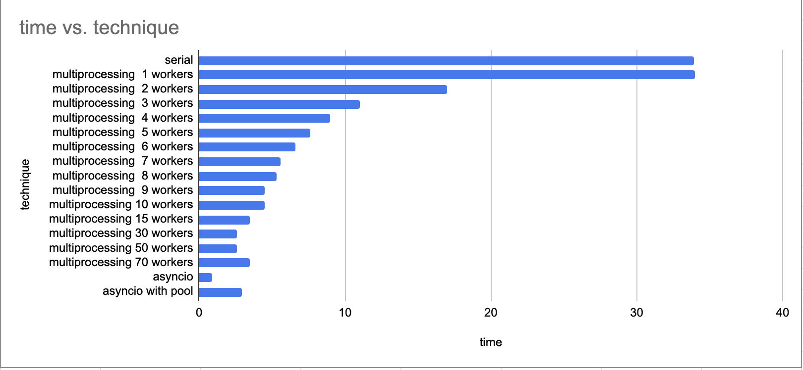
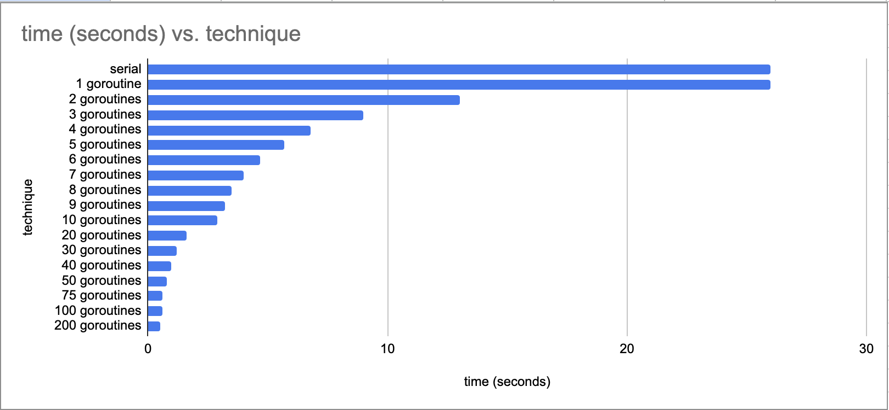

# Scanner Clouds

Scanner Clouds creates fake infrastructure for performance testing.

## Usage

```bash
# help
make

# start services
make run

# stop services
make stop
```

## Services

AWS

- S3

Note: Only AWS' S3 is supported to gather baseline information.

## Scan Process

The scan process works by the following steps:

- Run localstack
  - Create 2000 s3 buckets
- Run scanner
  - List all buckets
  - Iterate all buckets
  - Emit payloads to payload processor

- S3 Buckets: 2000 items

## Runtime Performance

Runtime performance uses at least 3 runs to calculate an average.

### [scanner-py](https://github.com/ericbutera/scanner-py)

The following table shows the runtime performance of different techniques. Serial is the baseline. Time is the total scan duration, therefore lower is faster.

The following shows runtime duration of different implementations. The file `main.py` represents the current serial baseline in use today. There are two other implementations:

- multi-threaded via multiprocessing
- async via asyncio

| file           | technique                  | time          |
|----------------|----------------------------|---------------|
| main.py        | serial                     | 33.90 seconds |
| worker_pool.py | multiprocessing  1 workers | 34.00 seconds |
| worker_pool.py | multiprocessing  2 workers | 17.00 seconds |
| worker_pool.py | multiprocessing  3 workers | 11.00 seconds |
| worker_pool.py | multiprocessing  4 workers | 09.00 seconds |
| worker_pool.py | multiprocessing  5 workers | 07.60 seconds |
| worker_pool.py | multiprocessing  6 workers | 06.60 seconds |
| worker_pool.py | multiprocessing  7 workers | 05.60 seconds |
| worker_pool.py | multiprocessing  8 workers | 05.30 seconds |
| worker_pool.py | multiprocessing  9 workers | 04.50 seconds |
| worker_pool.py | multiprocessing 10 workers | 04.50 seconds |
| worker_pool.py | multiprocessing 15 workers | 03.50 seconds |
| worker_pool.py | multiprocessing 30 workers | 02.60 seconds |
| worker_pool.py | multiprocessing 50 workers | 02.60 seconds |
| worker_pool.py | multiprocessing 70 workers | 03.50 seconds |
| async.py       | asyncio                    | 00.88 seconds |
| async_pool.py  | asyncio with pool          | 02.90 seconds |



### [scanner-go](https://github.com/ericbutera/scanner-go)

The following table shows the runtime performance of different techniques. Serial is the baseline. Time is the total scan duration, therefore lower is faster.

| technique      | time (sec) |
| -------------- | ---------- |
| serial         | 26         |
| 1 goroutine    | 26         |
| 2 goroutines   | 13         |
| 3 goroutines   | 09         |
| 4 goroutines   | 07         |
| 5 goroutines   | 5.7        |
| 6 goroutines   | 4.7        |
| 7 goroutines   | 4          |
| 8 goroutines   | 3.5        |
| 9 goroutines   | 3.2        |
| 10 goroutines  | 2.9        |
| 20 goroutines  | 1.6        |
| 30 goroutines  | 1.2        |
| 40 goroutines  | 0.98       |
| 75 goroutines  | 0.6        |
| 100 goroutines | 0.6        |
| 200 goroutines | 0.5        |



## Image Size

Since these images can be deployed in customer environments, we should be mindful of image size. The following table is a comparison of two different implementations.

This isn't completely fair as Python has asyncio & multiprocessing, but Python would still be significantly larger.

| image                         | version | size   |
|-------------------------------|---------|--------|
| ghcr.io/ericbutera/scanner-go | v0.0.1  | 8.33MB |
| ghcr.io/ericbutera/scanner-py | v0.0.1  | 360MB  |

## Notes

The scanners are currently configured to work against my [demo-app](https://github.com/ericbutera/demo-go) which has the initial payload processor interface. Payloads are cloud events and are sent to the `/api/payload/enqueue` endpoint. The endpoint queues the payload for later processing and returns a response very quickly.

Endpoints:

```json
// POST {{demo-app}}/api/payload/enqueue
{
  "source": "scanner-{py|go}",
  "type": "io.butera.scanner.aws.s3.bucket",
  "data": {
    "name": "bucket-name"
  }
}
```
